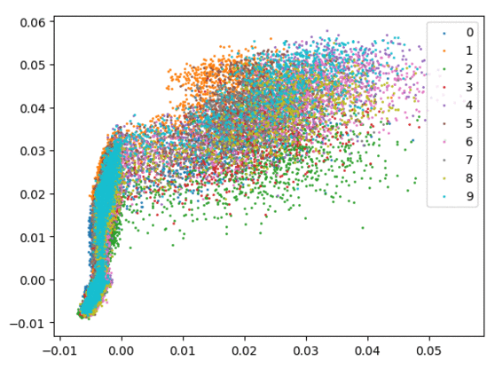
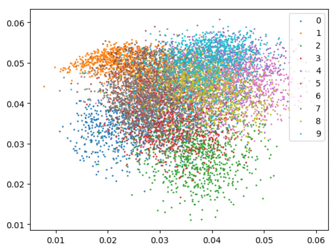

# pytorch-center-loss
Pytorch implementation of center loss: [Wen et al. A Discriminative Feature Learning Approach for Deep Face Recognition. ECCV 2016.](https://ydwen.github.io/papers/WenECCV16.pdf)

This loss function is also used by [deep-person-reid](https://github.com/KaiyangZhou/deep-person-reid).

## Get started
Clone this repo and run the code
```bash
$ git clone https://github.com/KaiyangZhou/pytorch-center-loss
$ cd pytorch-center-loss
$ python main.py --eval-freq 1 --gpu 0 --save-dir log/ --plot
```
You will see the following info in your terminal
```bash
Currently using GPU: 0
Creating dataset: mnist
Creating model: cnn
==> Epoch 1/100
Batch 50/469     Loss 2.332793 (2.557837) XentLoss 2.332744 (2.388296) CenterLoss 0.000048 (0.169540)
Batch 100/469    Loss 2.354638 (2.463851) XentLoss 2.354637 (2.379078) CenterLoss 0.000001 (0.084773)
Batch 150/469    Loss 2.361732 (2.434477) XentLoss 2.361732 (2.377962) CenterLoss 0.000000 (0.056515)
Batch 200/469    Loss 2.336701 (2.417842) XentLoss 2.336700 (2.375455) CenterLoss 0.000001 (0.042386)
Batch 250/469    Loss 2.404814 (2.407015) XentLoss 2.404813 (2.373106) CenterLoss 0.000001 (0.033909)
Batch 300/469    Loss 2.338753 (2.398546) XentLoss 2.338752 (2.370288) CenterLoss 0.000001 (0.028258)
Batch 350/469    Loss 2.367068 (2.390672) XentLoss 2.367059 (2.366450) CenterLoss 0.000009 (0.024221)
Batch 400/469    Loss 2.344178 (2.384820) XentLoss 2.344142 (2.363620) CenterLoss 0.000036 (0.021199)
Batch 450/469    Loss 2.329708 (2.379460) XentLoss 2.329661 (2.360611) CenterLoss 0.000047 (0.018848)
==> Test
Accuracy (%): 10.32  Error rate (%): 89.68
... ...
==> Epoch 30/100
Batch 50/469     Loss 0.141117 (0.155986) XentLoss 0.084169 (0.091617) CenterLoss 0.056949 (0.064369)
Batch 100/469    Loss 0.138201 (0.151291) XentLoss 0.089146 (0.092839) CenterLoss 0.049055 (0.058452)
Batch 150/469    Loss 0.151055 (0.151985) XentLoss 0.090816 (0.092405) CenterLoss 0.060239 (0.059580)
Batch 200/469    Loss 0.150803 (0.153333) XentLoss 0.092857 (0.092156) CenterLoss 0.057946 (0.061176)
Batch 250/469    Loss 0.162954 (0.154971) XentLoss 0.094889 (0.092099) CenterLoss 0.068065 (0.062872)
Batch 300/469    Loss 0.162895 (0.156038) XentLoss 0.093100 (0.092034) CenterLoss 0.069795 (0.064004)
Batch 350/469    Loss 0.146187 (0.156491) XentLoss 0.082508 (0.091787) CenterLoss 0.063679 (0.064704)
Batch 400/469    Loss 0.171533 (0.157390) XentLoss 0.092526 (0.091674) CenterLoss 0.079007 (0.065716)
Batch 450/469    Loss 0.209196 (0.158371) XentLoss 0.098388 (0.091560) CenterLoss 0.110808 (0.066811)
==> Test
Accuracy (%): 98.51  Error rate (%): 1.49
... ...
```

Please run `python main.py -h` for more details regarding input arguments.

## Results
We visualize the feature learning process below.

Softmax only. Left: training set. Right: test set.
<div align="center">
  
  
</div>

Softmax + center loss. Left: training set. Right: test set.
<div align="center">
  
  
</div>

## How to use center loss in your own project
1. All you need is the `center_loss.py` file
```python
from center_loss import CenterLoss
```
2. Initialize center loss in the main function
```python
center_loss = CenterLoss(num_classes=10, feat_dim=2, use_gpu=True)
```
3. Construct an optimizer for center loss
```python
optimizer_centloss = torch.optim.SGD(center_loss.parameters(), lr=0.5)
```
Alternatively, you can merge optimizers of model and center loss, like
```
params = list(model.parameters()) + list(center_loss.parameters())
optimizer = torch.optim.SGD(params, lr=0.1) # here lr is the overall learning rate
```

4. Update class centers just like how you update a pytorch model
```python
# features (torch tensor): a 2D torch float tensor with shape (batch_size, feat_dim)
# labels (torch long tensor): 1D torch long tensor with shape (batch_size)
# alpha (float): weight for center loss
loss = center_loss(features, labels) * alpha + other_loss
optimizer_centloss.zero_grad()
loss.backward()
# multiple (1./alpha) in order to remove the effect of alpha on updating centers
for param in center_loss.parameters():
    param.grad.data *= (1./alpha)
optimizer_centloss.step()
```
If you adopt the second way (i.e. use one optimizer for both model and center loss), the update code would look like
```python
loss = center_loss(features, labels) * alpha + other_loss
optimizer.zero_grad()
loss.backward()
for param in center_loss.parameters():
    # lr_cent is learning rate for center loss, e.g. lr_cent = 0.5
    param.grad.data *= (lr_cent / (alpha * lr))
optimizer.step()
```